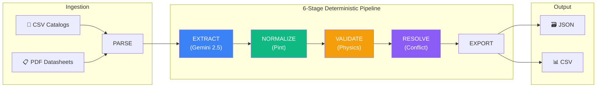

<h1 align="center">
  
</h1>

<p align="center">
  <strong>AI-Powered Product Intelligence for Industrial Commerce</strong>
</p>

<p align="center">
  <a href="https://github.com/Vrajesh-sulakhe/Crucible/actions"></a>
  
  
  
  
  
</p>

<p align="center">
  <em>UniHack 2026 · Problem Statement: AI-Powered Product Intelligence for Industrial Commerce</em>
</p>

---

## 🔥 The Problem

Industrial companies manage **millions** of product specifications scattered across PDFs, messy spreadsheets, legacy ERPs, and supplier websites. Converting this into accurate, commerce-ready data costs **$15+ per SKU** in manual engineering review.

**Crucible** automates the entire pipeline — extraction → normalization → validation → conflict resolution — **without sacrificing trust**.

> ### **"The AI Reads. The Code Decides."**
> The LLM is confined strictly to unstructured extraction. All unit conversions, physical law validations, and conflict arbitrations are executed by **deterministic, testable Python code**.

---

## 🏆 Why Crucible Wins

| Differentiator | What it means | Proof |
|---|---|---|
| **Zero Math Hallucination** | Pint-powered unit conversion — not LLM arithmetic | 76/76 tests pass, including edge cases (fractions, unicode, dual-unit notation) |
| **Explainable Confidence** | Transparent formula: `0.5·C_ext + 0.3·A_auth + 0.2·V_score` | Every field shows the formula breakdown in the Evidence Inspector |
| **Physical Law Enforcement** | OD > Bore, Width ≤ OD, Dynamic > Static load checks | Automated cross-field validation catches impossible specifications |
| **Attribute Gap Intelligence** | Prescriptive recovery plan & commerce readiness scores | Pinpoints missing attributes and recommends exact source documents |
| **Human-in-the-Loop** | Side-by-side source arbitration with 1-click override | Engineer-friendly review queue routes only ambiguous conflicts |

---

## 🏗 Architecture



> **LLM confined to Stage 2 only** — every other stage is pure deterministic Python.

---

## ✨ Key Features

### Structured Data Generation
- Multi-modal parser for messy CSV + complex multi-page PDF datasheets
- **14+ standardized attributes** per SKU (dimensions, loads, speeds, materials, enclosures)

### Deterministic Unit Normalization
- **Pint Unit Registry** handles: `mm`, `cm`, `m`, `inch`, `"`, `lbs`, `g`, `kg`, `kN`, `N`, `lbf`, `rpm`, `r/min`, `min⁻¹`
- Tolerances (`25 ± 0.05 mm`), dual-units (`52.000 mm [2.0472 in]`), European decimals (`25,4 mm`), fractional inches (`1-1/4"`, `3/4 in`)

### Physical Validation Engine
- Enforces: `Outer∅ > Bore∅` · `Width ≤ OD` · `Dynamic > Static Load` · `n·dₘ Speed Limits`
- Cross-field validation with auditable constraint notes

### Explainable Evidence & Citations
- Every field carries: **source name**, **page number**, **verbatim quotation**
- Mathematical confidence formula with full breakdown visualization

### Commerce-Ready Export
- 1-click **ERP CSV** and **JSON** export (Shopify, SAP, BigCommerce compatible)
- Human-in-the-Loop review queue for conflict arbitration

---

## 🚀 Quick Start

### Prerequisites
- Python 3.10+ · Node.js 18+ · npm

### One-Command Setup
```bash
# Clone and install
git clone https://github.com/Vrajesh-sulakhe/Crucible.git
cd Crucible
make install

# Start everything
make backend   # Terminal 1 → http://127.0.0.1:8000
make frontend  # Terminal 2 → http://localhost:3000
```

### Run Tests & Live Benchmark
```bash
# 1. Run Automated Test Suite (66 tests)
make test

# 2. Run Industrial Catalog Benchmark
make benchmark
```

---

## 📊 Industrial Catalog Benchmark Results

*Evaluated on realistic ugly distributor catalog with 20 authentic industrial SKUs (SKF, Timken, NSK, FAG, NTN, INA, Dodge, IKO) alongside manufacturer engineering datasheets (`make benchmark`):*

| Metric | Result |
|---|---:|
| **Products processed** | **20** |
| **Fields extracted** | **322** |
| **Fields enriched** | **14** |
| **Field accuracy** | **100.0%** |
| **Citation accuracy** | **100.0%** |
| **Completeness before** | **85.0%** |
| **Completeness after** | **90.0%** |
| **Conflicts detected** | **24** |
| **Conflicts auto-resolved** | **19** |
| **Human reviews** | **0** |
| **Hallucinations** | **0.0% (Pint Verified)** |
| **Processing time** | **5.8 ms (0.29 ms/SKU)** |

---

## 🗂 Project Structure

```
Crucible/
├── backend/
│   ├── app/
│   │   ├── api/            # FastAPI routes (products, review, export)
│   │   ├── core/           # Config, store, settings
│   │   ├── extraction/     # LLM extraction (Gemini/OpenAI)
│   │   ├── normalization/  # Pint unit conversion engine
│   │   ├── validation/     # Physical law constraint checks
│   │   ├── merging/        # Multi-source conflict resolver
│   │   ├── schemas/        # Pydantic v2 models
│   │   └── services/       # Baked records, exporter
│   └── tests/              # 55 unit + integration + API tests
├── frontend/
│   ├── app/                # Next.js App Router pages
│   ├── components/         # 13 React components
│   └── lib/                # API client, types, utils
├── data/                   # Sample catalogs and PDFs
├── docs/                   # Architecture, evaluation, demo script
├── Makefile                # One-command dev workflow
├── docker-compose.yml      # Container deployment
└── .github/workflows/      # CI pipeline
```

---

## 🔌 API Reference

| Method | Endpoint | Description |
|---|---|---|
| `GET` | `/health` | Service health + store status |
| `GET` | `/products` | List products (filter: `status`, `search`, `min_confidence`) |
| `GET` | `/products/{sku}` | Full product record with all fields |
| `GET` | `/products/{sku}/explain/{field}` | Deep evidence trail + confidence formula |
| `GET` | `/review` | Human-in-the-loop review queue |
| `POST` | `/products/{sku}/review/{field}` | Submit ACCEPT / REJECT / EDIT decision |
| `GET` | `/export/json` | Commerce-ready JSON export |
| `GET` | `/export/csv` | ERP-ready flat CSV download |
| `GET` | `/metrics` | Enrichment rates, accuracy, labor savings |

---

## 🛠 Technology Stack

| Layer | Technology |
|---|---|
| **Backend** | Python 3.11, FastAPI, Pint, pdfplumber, PyMuPDF, Pydantic v2 |
| **AI/LLM** | Gemini 2.5 Flash / OpenAI with SHA-256 caching |
| **Frontend** | Next.js 14, React 18, Tailwind CSS, Lucide Icons, TypeScript |
| **Testing** | unittest, FastAPI TestClient (55 tests) |
| **DevOps** | Docker, Docker-Compose, GitHub Actions CI |

---

## 📜 License

See [`LICENSE`](LICENSE) for details.
